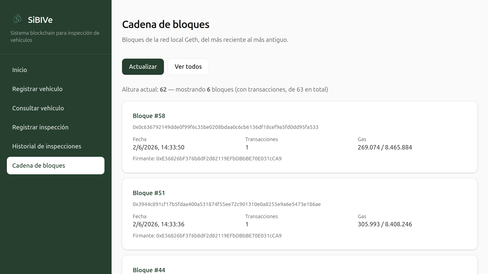

# Sistema Blockchain para Inspección de Vehículos (SiBIVe)

Proyecto del curso de Ciberseguridad (2026-1) basado en el laboratorio de blockchain, por fnovoas.

DApp para el registro y seguimiento de inspecciones vehiculares sobre una blockchain privada Ethereum (Geth). El entorno es autocontenido: ya no requiere MetaMask ni Remix.



## Componentes

| Capa | Tecnología |
|------|------------|
| Smart contract | Solidity (`VehicleInspection.sol`) |
| Blockchain | Geth (Clique, red privada) |
| Backend | Flask + Web3.py |
| Frontend | Next.js |
| Orquestación | Docker Compose + Makefile |

## Arquitectura

```
Frontend (Next.js)  →  Backend (Flask)  →  Geth (blockchain local)
     :3000                  :5000                 :8545
```

El backend:

1. Despliega automáticamente el contrato al arrancar (`deploy.py`), usando `bytecode.txt` y `abi.json` precompilados (sin descargar compiladores en tiempo de ejecución).
2. Guarda dirección y ABI en `sibive-backend/runtime/contract_info.json` (volumen persistente).
3. Firma transacciones en memoria (`sign_transaction` + `send_raw_transaction`) con la cuenta de laboratorio; no usa MetaMask.

Geth mina bloques al iniciar (`--mine` y `--miner.etherbase` en `geth-node/start_geth_node.sh`). En redes Clique (PoA), el campo `miner` del header suele ser `0x0`; la API de bloques expone el **firmante** real vía `clique_getSigner`.

## Contrato `VehicleInspection`

- **Vehículo:** placa `AAA000`, tipo (`0` gasolina / `1` diésel), año del modelo.
- **Inspección:** gases en ralentí/crucero (gasolina), opacidad (diésel), CO₂/O₂, temperatura y RPM de prueba, y defectos de rechazo directo (humo continuo, fuga de escape, falta de tapón/filtro).
- **Aprobación on-chain:** rechazo directo → condiciones de prueba (temp. ≥ 60 °C, RPM en rangos) → criterio de dilución → límites de CO/HC u opacidad según **año modelo** del vehículo.
- Valores decimales en cadena como enteros (p. ej. `1,0 %` de CO → `100`).

## Cuenta de laboratorio

Solo para este entorno local controlado (sin valor real):

| Campo | Valor |
|-------|--------|
| Dirección | `0xe56826bf376b8df2d82119efbdbbbe70e031cca9` |
| Clave privada | ver `README` / script `extract_key.py` (keystore en `geth-node/data`) |
| Chain ID (firma de transacciones) | `12345` (`genesis.json`) |
| Network ID (Geth) | `23422` |

El backend usa esta clave internamente. Geth desbloquea la misma cuenta solo para firmar bloques Clique (`--unlock` en el contenedor).

## Requisitos

- Docker y Docker Compose
- Make
- Puertos libres: `3000`, `5000`, `8545`

## Ejecución rápida

En la raíz del proyecto:

```bash
make clean    # opcional: reinicio completo de cadena y contrato
make build
```

Espera unos segundos a que el backend despliegue el contrato. Comprueba:

```bash
curl http://127.0.0.1:5000/
# → API SIBIVE funcionando
```

Abre el frontend: **http://localhost:3000**

### Flujo en la aplicación

1. **Registrar vehículo** (`/register`) — placa `AAA000`, tipo de combustible y año modelo.
2. **Consultar vehículo** (`/query`) — consulta por placa: tipo de combustible y año modelo.
3. **Registrar inspección** (`/inspection`) — placa ya registrada; el formulario se adapta a gasolina o diésel. Incluye atajos para rellenar valores normales, máximos permitidos o limpiar campos.
4. **Historial de inspecciones** (`/history`) — listado global; filtro por placa y por contaminante.
5. **Cadena de bloques** (`/blocks`) — bloques locales (más recientes arriba), con dirección del firmante Clique.

Si el vehículo ya existe en la cadena, el backend responde con un mensaje claro (no hace falta volver a registrarlo; pasa directo a inspección).

## API REST (backend)

| Método | Ruta | Descripción |
|--------|------|-------------|
| `GET` | `/` | Estado del API |
| `POST` | `/vehicle` | Registrar vehículo (`plate`, `type`, `modelYear`) |
| `GET` | `/vehicle/<plate>/info` | Tipo y año modelo |
| `GET` | `/vehicle/<plate>/type` | Tipo, año modelo y campos de inspección aplicables |
| `GET` | `/vehicle/<plate>` | Inspecciones del vehículo |
| `POST` | `/inspection` | Registrar inspección (todos los campos del contrato) |
| `GET` | `/inspections` | Todas las inspecciones |
| `GET` | `/blocks` | Bloques (`?limit=N` opcional) |

## Comandos Makefile

| Comando | Descripción |
|---------|-------------|
| `make build` | Construye imágenes y levanta servicios en segundo plano |
| `make up` | Levanta servicios (sin reconstruir) |
| `make down` | Detiene contenedores |
| `make clean` | Detiene servicios, borra cadena local y `contract_info.json` |
| `make restart` | `clean` + `build` (usa `sudo` en `clean`; ver solución de problemas) |
| `make mine` | Inicia el minero manualmente (opcional; Geth ya mina con `--mine`) |
| `make stop-mine` | Detiene el minero |
| `make logs` | Logs de todos los servicios |
| `make logs-backend` | Logs del backend (despliegue, API, errores) |
| `make logs-frontend` | Logs del frontend |
| `make frontend-install` | `npm install` en `sibive-frontend` (desarrollo fuera de Docker) |
| `make compile-contract` | Recompila `bytecode.txt` y `abi.json` desde `VehicleInspection.sol` |

## URLs

- Frontend: http://localhost:3000  
- Backend: http://localhost:5000  
- API bloques: `GET http://localhost:5000/blocks` (opcional `?limit=N`)  
- Geth HTTP RPC: http://localhost:8545 (solo uso interno del backend)  

## Archivos relevantes

| Ruta | Uso |
|------|-----|
| `VehicleInspection.sol` | Contrato fuente |
| `sibive-backend/bytecode.txt`, `abi.json` | Binario y ABI usados por `deploy.py` |
| `sibive-backend/runtime/contract_info.json` | Dirección desplegada + ABI (generado al arrancar) |
| `sibive-backend/runtime/app.log` | Registro de errores y eventos del backend |
| `geth-node/data/` | Datos persistentes de la blockchain (bind mount) |
| `scripts/extract_solc.py` | Extrae bytecode/ABI tras `make compile-contract` |

Para regenerar bytecode/ABI tras cambiar el `.sol`:

```bash
make compile-contract
make build
```

El bytecode debe compilarse con **EVM Paris** (sin opcode `PUSH0`). El target `compile-contract` usa `solc 0.8.19` con `--evm-version paris` y `--via-ir` (necesario por el tamaño del contrato). El Makefile preprocesa una copia en `.build/` (sin NatSpec y con literales ASCII) para que `solc` compile sin errores de caracteres Unicode.

## Solución de problemas

### 1. `make clean` no borra `geth-node/data/geth`

Si antes usaste `sudo`, los archivos pueden ser de root:

```bash
sudo rm -rf geth-node/data/geth
make clean
make build
```

Evita `sudo make clean` en adelante; usa el mismo usuario que ejecuta Docker.

Al ejecutar `make clean` (o `docker-compose`) con **`sudo`**, los archivos que se crean dentro de `geth-node/data/geth` —la base de datos de la blockchain en el host— quedan como **propiedad del usuario root**. El target `make clean` hace un `rm -rf geth-node/data/geth` sin `sudo`, así que el usuario normal no tiene permiso para borrarlos: el comando falla en silencio (en el Makefile está el `-` delante del `rm`, que ignora el error) o vemos “Permiso denegado”, y la cadena **sigue en disco**. Al hacer `make build`, Geth y el backend arrancan sobre esa blockchain antigua, con contratos y registros de pruebas anteriores, mientras que `contract_info.json` puede regenerarse o apuntar a otro contrato. Eso produce comportamientos confusos: placas “ya registradas”, nonces desfasados o historial vacío.

La solución funciona porque **`sudo rm -rf geth-node/data/geth`** borra la carpeta con los permisos de root, dejando el directorio listo para que el siguiente `make clean` / `make build` (como usuario normal) cree una cadena nueva desde el `genesis.json`. A partir de ahí, conviene no usar **`sudo`** en make ni en `docker-compose` (el usuario debe estar en el grupo docker): así los archivos de `geth-node/data/` los crea el mismo usuario que luego puede borrarlos con `make clean`, y cada reinicio completo realmente empieza de cero.

### 2. El backend no responde / Network Error en el navegador

Comprueba que el contenedor esté en marcha:

```bash
docker-compose ps
make logs-backend
```

Busca la línea `Contrato desplegado en: 0x...`. Si el backend sale con error, revisa `sibive-backend/runtime/app.log`.

### 3. `nonce too low` o vehículo ya registrado

La cadena conserva datos entre ejecuciones si no hiciste `make clean`. Usa otra placa o reinicia la cadena. Si la placa ya existe, registra solo la inspección.

### 4. Consulta vacía tras registrar

Suele deberse a un contrato distinto al de los registros (cadena antigua + `contract_info.json` nuevo). Ejecuta `make clean` y `make build` para alinear cadena y contrato.

## Configuración manual (opcional)

Para depurar Geth fuera de Docker:

```bash
./start_geth.sh
# contraseña del keystore: 123
```

En la consola de Geth: `miner.start()`. Este flujo es **opcional**; el stack Docker ya cubre el uso normal de la DApp.

## Notas de diseño

- `geth-node/data/` se excluye del contexto de build (`.dockerignore`) para no empaquetar la cadena en la imagen; los datos viven en el host vía volumen.
- Las transacciones fallidas o revertidas no se reportan como éxito: el API valida el recibo on-chain y devuelve mensajes de error al frontend.
- `make mine` sigue disponible por si detenemos el minero con `make stop-mine`; en el arranque normal no es obligatorio.
- En `/blocks`, el campo mostrado como firmante proviene de `clique_getSigner`, no del `miner` del header (habitualmente cero en Clique).
